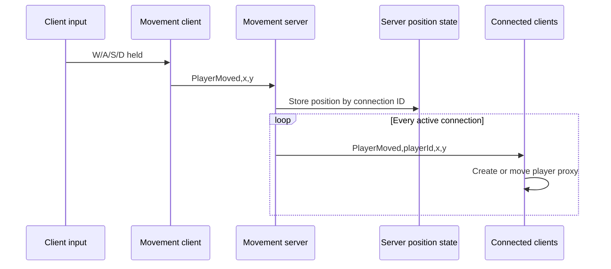

# Realtime Movement Server

Unity Transport server for a small realtime 2D movement prototype. It accepts position updates from clients, stores the latest position for each connection ID, and broadcasts those updates to every connected client.

**Paired repository:** [Realtime Movement Client](https://github.com/PapiChulllo/realtime-movement-client)

## Stack and configuration

- Unity `2022.3.5f1`
- Unity Transport `1.3.4`
- UDP port `9001`
- IPv4 bind address: all local interfaces (`NetworkEndPoint.AnyIpv4`)
- Scene: `Assets/Scenes/SampleScene.unity`

## How the pair works

1. A player holds W, A, S, or D in the client.
2. `PlayerMovement` moves the local GameObject and sends a `PlayerMoved` message.
3. The server uses the sender's connection ID as the player ID and stores the reported position.
4. The server broadcasts a position message to all active connections.
5. Each client creates or updates the corresponding remote player proxy.

## Transport pipelines

Both applications create the same two Unity Transport pipelines:

- **Reliable and in order:** `FragmentationPipelineStage` followed by `ReliableSequencedPipelineStage`. All current movement messages use this pipeline, so accepted position updates are delivered in sequence with reliability provided by Unity Transport.
- **Fire and forget:** `FragmentationPipelineStage` only. The networking layer can select it, but the current movement flow never does; no gameplay message presently uses the unreliable pipeline.

Each application prefixes a message with its byte length as a transport `int`, then writes the message as `.NET Encoding.Unicode` bytes (UTF-16 little-endian on the supported runtime).

## Message protocol

| Direction | Message | Pipeline | Meaning |
| --- | --- | --- | --- |
| Client → server | `PlayerMoved,<x>,<y>` | Reliable sequenced | Client reports its authoritative local position. |
| Server → clients | `PlayerMoved,<playerId>,<x>,<y>` | Reliable sequenced | Server relays the stored position under the sender's connection ID. |

The comma-separated payload has no escaping or schema/version field. Numeric interpolation and `float.Parse` use the process's current culture; cultures that use commas as decimal separators can conflict with the comma delimiter.

## Connection lifecycle

- On startup, the server binds UDP port `9001`, listens, and allocates a connection list.
- Each accepted connection receives the lowest currently unused integer ID.
- On connect, the server sends that client every position currently held in `playerPositions`.
- During each frame, it completes the transport update, removes invalid connection handles, accepts pending connections, and drains connection events.
- On disconnect, connection lookup entries are removed, but the associated position is **not** removed from `playerPositions`. A future client can therefore receive stale position state, and a reused connection ID can overwrite it.
- On destruction, the driver and persistent connection list are disposed.

## Run in the Unity Editor

1. Open this repository root in Unity Hub with Unity `2022.3.5f1`.
2. Open `Assets/Scenes/SampleScene.unity`.
3. Enter Play mode and confirm the Console reports that the server is listening on port `9001`.
4. Only after the server is listening, open the [client repository](https://github.com/PapiChulllo/realtime-movement-client) as a separate Unity project, configure its server address, open its `SampleScene`, and enter Play mode.
5. Use W, A, S, and D in the client Game view.

For same-machine use, change the `IPAddress` constant in the client repository's `Assets/Scripts/NetworkClient.cs` from the current hardcoded `10.0.0.82` to `127.0.0.1`. For LAN use, set it to the server machine's IPv4 address. This is a required source configuration step; this server needs no address change because it binds all IPv4 interfaces. Keep UDP `9001` reachable through the host firewall.

## Repository map

| Path | Responsibility |
| --- | --- |
| `Assets/NetworkServer.cs` | Driver setup, pipelines, UDP bind/listen, connection IDs, event polling, framing, and sends. |
| `Assets/NetworkServerProcessing.cs` | Parses client messages and bridges transport events to game logic. |
| `Assets/GameLogic.cs` | Stores reported positions and broadcasts updates/snapshots. |
| `Assets/Scenes/SampleScene.unity` | Editor scene containing the server networking and game-logic components. |
| `Packages/manifest.json` | Pins Unity Transport and other Unity package dependencies. |
| `ProjectSettings/` | Unity `2022.3.5f1` project configuration. |

## Authored responsibilities

This server side demonstrates direct Unity Transport lifecycle management, two custom pipeline definitions, connection-to-player ID mapping, explicit binary framing around a string protocol, in-memory position state, late-join synchronization, and fan-out broadcasting. The paired client owns input capture and proxy visualization.

## Limitations

- Positions are client-authoritative. The server does not validate speed, bounds, timestamps, ownership beyond connection ID, malformed values, or message rate.
- There is no authentication, authorization, TLS/encryption, matchmaking, lobby, discovery, reconnect, interpolation, prediction, reconciliation, or persistence.
- The string/Unicode protocol is allocation-heavy, delimiter-sensitive, unversioned, and culture-sensitive for floats.
- Stored positions survive disconnects and can be sent as stale state to later clients.
- The configured capacity is `1000`, but there is no load testing, backpressure, or production hardening.
- There are no automated tests. Unity compilation, Play mode, and standalone builds have not been verified in this documentation pass because Unity was unavailable.

## Related project

See the [Realtime Movement Client](https://github.com/PapiChulllo/realtime-movement-client) for input, connection setup, and remote proxy rendering.
